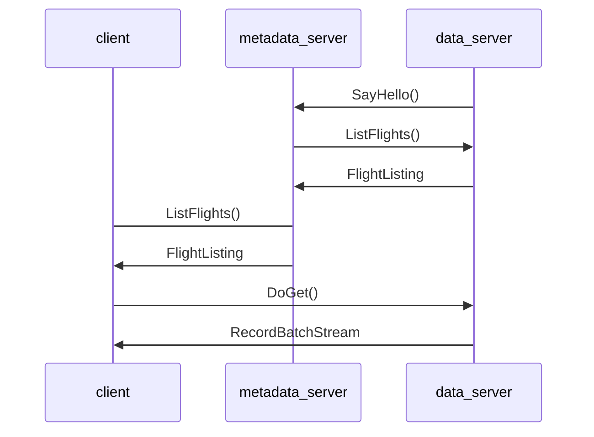

# distributed_with_opentelemetry

Example of distributed [Apache Arrow Flight](https://arrow.apache.org/docs/format/Flight.html) instrumented with [OpenTelemetry](https://opentelemetry.io/).
Distributed in this case means the Flight Server is split into two types:

1. **Metadata Server:** Handles ListFlights, GetFlightInfo
2. **Data Server:** Handles DoGet, DoPut, etc

The main reason to split the server into two is so instances of the two types can be horizontally scaled independently to handle increased load.
How this works is that any Flight Client would first talk to the Metadata Server to get a list of Flights and then it would go directly to the Data Server instances to get data.

Because this example uses OpenTelemetry and the underlying client and server implementations are manually instrumented, we can use a tool like JaegerUI to visualize the flow:


## Implementation

The first challenge with a distributed server setup is to find a way for the Metadata Server to know about Data Servers and to know what Flights those servers can serve.
There are a lot of ways this could be implemented but for this example we do something simple: When a Data Server instance starts, it connects to the Metadata Server and advertises itself using an custom Action, `SayHello`. The Metadata Server then queries the Data Server for a list of the Flights it can serve and saves that information for later.

When a Client wants to get data, it asks the Metadata Server for a list of Flights. Each Flight in the response lists one or more instances of a Data Server as an Endpoint and then the client can them get the data from any of the Endpoints.

This is the scenario documented in the [Arrow Flight RPC docs](https://arrow.apache.org/docs/format/Flight.html#downloading-data).

Here's how this looks:



## How to Run This

### Pre-requisites

- Docker & Docker Compose
- Python & pip

### Setup

1. Create a `flight_datasets` folder in this directory and add one or more Parquet files
2. Install Python requirements with `python -m pip install -r requirements.txt`

### Running the servers

Note: This can take a while because this does a Docker-based build of Arrow and a few dependencies.

```sh
docker compose up
```

### Running the Client

```sh
python list_and_get_all_flights.py
```

Now navigate to http://localhost:16686 and you should see a single trace that looks similar to the screenshot above.
