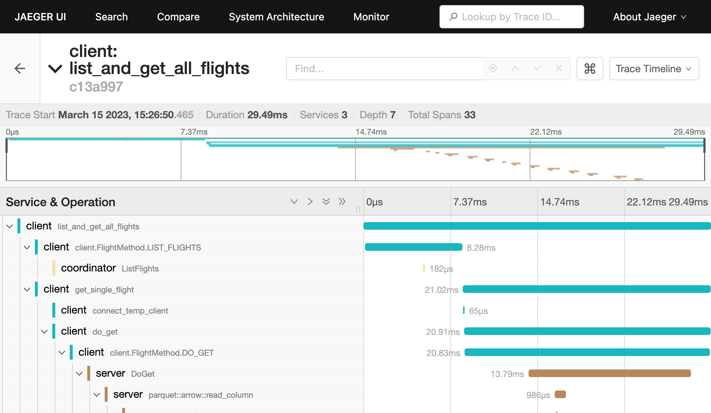

# otel_example_distributed

Example of Apache Arrow Flight instrumented with OpenTelemetry that splits the Flight Server into two components:

1. **Coordinator:** Serves Flight RPC methods such as ListFlights, GetFlightInfo
2. **Server:** Serves potentially long-running Flight RPC methods such as DoGet (eventually: DoPut)

The rationale for the split is to make it easier to scale to scenarios where there are hundreds (or thousands) of Flight clients you'd like to horizontally scale your Flight servers to support the increased concurrency.
To make this example easier to understand and debug, OpenTelemetry has been integrated in such a way that context is propagated seamlessly between the client and servers.



## How This Works

The Coordinator needs to know about the Flights the Server(s) can serve.
There are certainly a few ways this could be implemented but the method used here is to have the Server advertise the Flights it can serve to the the Coordinator when it starts up.
*Note: De-registration hasn't been implemented to handle the case where a Server goes down and can no longer fulfill DoGet calls but you would want to do this in a real scenario.

The following sequence diagram shows the order or calls from startup to a client request for all Flights:

```mermaid
sequenceDiagram
    participant client
    participant coordinator
    participant server
    server->>coordinator: SayHello()
    coordinator->>server: ListFlights()
    server->>coordinator: FlightListing
    client->coordinator: ListFlights()
    coordinator->>client: FlightListing
    client->>server: DoGet()
    server->>client: RecordBatchStream
```

## How to Run This

### Pre-requisites

- Docker & Docker Compose
- Python & pip

### Setup

1. Create a `flight_datasets` folder in this directory and add one or more Parquet files
2. Install Python requirements with `python -m pip install -r requirements.txt`

### Running the Coordinator and Server

```sh
docker compose up
```

### Running the Client

```sh
python list_and_get_all_flights.py
```

Now navigate to http://localhost:16686 and you should see a single trace that looks similar to the screenshot above.
